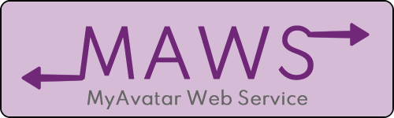

<!--
  Software manual template (b210104)
  https://github.com/APrettyCoolProgram/my-development-environment/tree/master/templates/documentation
-->

<h1 align="center">

  
   
  MANUAL
   

</h1>

<h5 align="center">

  [ABOUT MAWS](manual.md)&nbsp;&bull;&nbsp;HOSTING MAWS&nbsp;&bull;&nbsp;[IMPORTING MAWS](manual-importing-maws.md)&nbsp;&bull;&nbsp;[SCRIPTLINK EVENTS](manual-scriptlink-events.md)&nbsp;&bull;&nbsp;[MAWS CALLS](manual-maws-calls.md)&nbsp;&bull;&nbsp;[CUSTOM MYAVATAR WEB SERVICES](manual-custom-myavatar-web-services.md)

</h5>
<h1></h1>

# HOSTING MAWS
Web services that interface with myAvatar™ need to be hosted at a location where myAvatar™ can access them, and MAWS is no exception. There are two options for hosting MAWS:

1. **Have Netsmart host MAWS** 
If your myAvatar™ environments are hosted by Netsmart, you can have Netsmart - for an additional cost - host MAWS (and other custom web services) as well. If you choose to have Netsmart host MAWS, you can skip this section of the manual, and go straight to the section that discusses [importing MAWS](#importing-maws) into your myAvatar™ environment(s).  
*Please note: MAWS has not been tested in a hosted environment, just self-hosted!*

2. **Self-host MAWS**  
If you self-host your myAvatar™ environments, or would rather have complete control over your custom web services, you can self-host them. This section will offer some guidance, if that's they way you want to do it.

### Before you begin
A few things before you begin:

* I'm sure you can host MAWS, and other myAvatar™ custom web services, using other web servers like [Apache]() and [NGINX](), but these steps focus on [Microsoft Internet Information Services (IIS)](), specifically version 10.

* These are the steps that I used - twice! - to host MAWS in our environment, but they are more of a *guideline* than a perfect set of instructions. It's quite possible that I didn't follow best-practices, or maybe I have something setup incorrectly, so please use caution when following these steps. And since I (hopefully?) won't have to do this again, this section will probably not be updated.

* This document assumes that you already have a Windows Server with IIS up and running.

### What I used
* Microsoft Windows 2019
* Microsoft Internet Information Services (IIS) version 10

# CREATING AN APPLICATION POOL
I’m not sure this step is necessary, but it helps to make things a little more organized…maybe? I’m not an IIS expert, so I’m not sure.

From within IIS:
1. Right-click the **Application Pools** connection
2. Choose **Add Application Pool…**

The new application pool should be a **".NET 4.0 CLR (.NET 4.5)"** pool. I’ve chosen .NET 4.5, since it lines up with the Netsmart ScriptLink Objects that we will be using.

I’ve named the application pool *AvatoolWebService*.

<h6 align="center">

  
   
  What my Application Pools setup looks like
   

</h6>

# CREATING A NEW SITE
From within IIS:
1. Right-click the **Sites** connection
2. Choose **Add Website**
3. The **Site name** should be: *AvatoolWebService*
4. The **Application pool** should be: *AvatoolWebService*
5. The **Physical path** should be: */path/to/your/files/*
6. Set the binding for port :80
6. Set the binding for port :443

<h6 align="center">

  
   
  Adding a new website
   

</h6>

# INSTALLING THE ASP.NET ROLE
ASP.NET is required by Web Services, so add the ASP.NET role to IIS.

Once that’s done, your IIS roles should look like this:

<h6 align="center">

  
   
  Probably?
   

</h6>

# DISABLING THE DEFAULT SITE
Might as well do this? Probably?

From within IIS:
1. Right-click the Default Web Site
2. Choose **Manage Web Site**
3. Choose **Stop**

# VERIFYING THE NEW SITE
Your AvatoolWebService site should look like this:

<h6 align="center">

  
   
  Maybe?
   

</h6>

# ENABLING DIRECTORY BROWSING
From within IIS:
1. Double-click on the **Directory Browsing** icon
2. Choose **Enable**
3. Click **Apply**

<h6 align="center">

  
   
  Enabling directory browsing
   

</h6>

At this point, you should be able to point a browser to your website, and see the landing page.

***

<h5 align="center">

  [ABOUT MAWS](manual.md)&nbsp;&bull;&nbsp;HOSTING MAWS&nbsp;&bull;&nbsp;[IMPORTING MAWS](manual-importing-maws.md)&nbsp;&bull;&nbsp;[SCRIPTLINK EVENTS](manual-scriptlink-events.md)&nbsp;&bull;&nbsp;[MAWS CALLS](manual-maws-calls.md)&nbsp;&bull;&nbsp;[CUSTOM MYAVATAR WEB SERVICES](manual-custom-myavatar-web-services.md)

</h5>