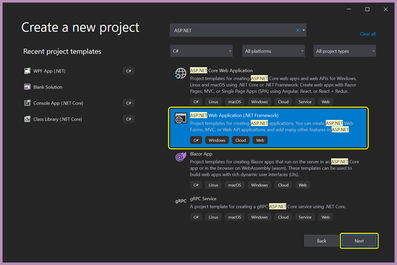
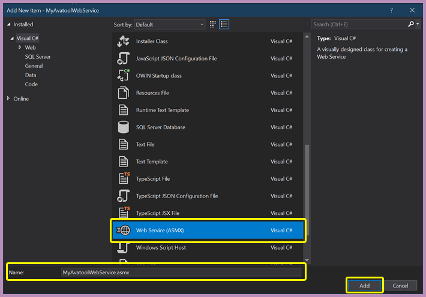

<!--
  Software manual template (b210104)
  https://github.com/APrettyCoolProgram/my-development-environment/tree/master/templates/documentation
-->

<h1 align="center">

  
  <br>
  MANUAL
  <br>

</h1>

<h4 align="center">

  MAWS v0.1&nbsp;&bull;&nbsp;Last updated January 11, 2021

</h4>

***

<!-- The HTML indentations have to stay this way to work. -->
<table>
<tr>
<td img src="non-existant-spacer.png" alt="non-existant-spacer" width="1020" height="1">

  ### CONTENTS
  * [ABOUT MAWS](#about-maws)
  * [HOSTING MAWS](#hosting-maws)
  * [IMPORTING MAWS](#importing-maws)
  * [CREATING SCRIPTLINK EVENTS](#creating-scriptlink-events)
  * [USING MAWS](#using-maws)
    * [ADMISSION FORM](#admission-form)
    * [CROSS EPISODE FINANCIAL ELIGABLITY FORM](#cross-episode-financial-eligability-form)
  * [CUSTOM myAvatar™ WEB SERVICES](#custom-myAvatar™-web-services)
    * [CREATING A CUSTOM myAvatar WEB SERVICE](#creating-a-custom-myAvatar-web-service)
    * [HOSTING A CUSTOM myAvatar WEB SERVICE](#hosting-a-custom-myAvatar-web-service)
    * [USING A CUSTOM myAvatar WEB SERVICE](#using-a-custom-myAvatar-web-service)

</td>
</tr>
</table>

# ABOUT MAWS
The myAvatool Web Service (**MAWS**) is a custom web service for [Netsmart's myAvatar™ EHR](https://www.ntst.com/Solutions-and-Services/Offerings/myAvatar) which includes various tools and utilities that aren't included in the official release, and provides a solid foundation for building additional functionality quickly and efficiently.

More information about MAWS, from the README, will go here.

### The MAWS manual
This manual will cover:
* The stuff from the contents above

# HOSTING MAWS
Web services that interface with myAvatar™ need to be hosted at a location where myAvatar™ can access them, and MAWS is no exception. There are two options for hosting MAWS:

1. Have Netsmart host MAWS<br>
If your myAvatar™ environments are hosted by Netsmart, you can have Netsmart - for an additional cost - host MAWS (and other custom web services) as well. If you choose to have Netsmart host MAWS, you can skip this section of the manual, and go straight to the section that discusses [importing MAWS](#importing-maws) into your myAvatar™ environment(s).

2. If you self-host your myAvatar™ environments, or would rather have complete control over your custom web services, you can self-host them. This section will offer some guidance, if that's they way you want to do it.

### A note about hosting MAWS with Netsmart
MAWS has not been tested in a hosted environment, just self-hosted!

### Before you begin
These are the steps that I used - twice! - to host MAWS in our environment, but they are more of a *guideline* than a perfect set of instructions. It's quite possible that I didn't follow best-practices, or maybe I have something setup incorrectly, so please use caution when following these steps. And since I (hopefully?) won't have to do this again, this section will probably not be updated.

### What I used
* Microsoft Windows 2019
* Microsoft Internet Information Services (IIS) version 10

*This document assumes that you already have a Windows Server with IIS up and running.*

## CREATING AN IIS APPLICATION POOL
I’m not sure this step is necessary, but it helps to make things a little more organized…maybe? I’m not an IIS expert, so I’m not sure.

From within IIS:
1. Right-click the **Application Pools** connection
2. Choose **Add Application Pool…**

The new application pool should be a *.NET 4.0 CLR (.NET 4.5)* pool. I’ve chosen .NET 4.5, since it lines up with the Netsmart ScriptLink Objects that we will be using, but you can choose another .NET version.

I’ve named the application pool *AvatoolWebService*.

<h6 align="center">

  
  <br>
  What my Application Pools setup looks like
  <br>

</h6>

## CREATE A NEW SITE
From within IIS:
1. Right-click the **Sites** connection
2. Choose **Add Website**
3. The **Site name** should be: *AvatoolWebService*
4. The **Application pool** should be: *AvatoolWebService*
5. The **Physical path** should be: */path/to/your/files/*
6. Set the binding for port :80
6. Set the binding for port :443

<h6 align="center">

  
  <br>
  Adding a new website
  <br>

</h6>

## DISABLE THE DEFAULT WEBSITE
Might as well do this? Probably?

From within IIS:
1. Right-click the Default Web Site
2. Choose **Manage Web Site**
3. Choose **Stop**

## INSTALL THE ASP.NET ROLE
ASP.NET is required by Web Services, so add the ASP.NET role to IIS.

Once that’s done, your IIS roles should look like this:

<h6 align="center">

  
  <br>
  Probably?
  <br>

</h6>

## Verifying the AvatoolWebService site
Your AvatoolWebService site should look like this:

<h6 align="center">

  
  <br>
  Maybe?
  <br>

</h6>

## ENABLE DIRECTORY BROWSING
From within IIS:
1. Double-click on the **Directory Browsing** icon
2. Choose **Enable**
3. Click **Apply**

<h6 align="center">

  
  <br>
  Maybe?
  <br>

</h6>

At this point, you should be able to point a browser to your website, and see the landing page.

# IMPORTING MAWS
In order for myAvatar™ to use MAWS, you'll need to import MAWS into myAvatar™. This section will walk your through the following process:

### Before you begin
#### Do you know where is MAWS located?
To continue with this documentations, you will need to know the location of MAWS in your environment.

## CONFIRMING THE MAWS WSDL
Before attempting to import MAWS into myAvatar™, you should make sure that you have a valid **W**eb **S**ervice **D**escription **L**anguage (WSDL) URL. To do this, paste the URL of the MAWS WSDL in a web browser and attempt to access the URL.

For example, pointing a browser to `https://your-organization.com/MyAvatoolWebService.asmx?WSDL` should display XML that looks something like this:

<h6 align="center">

  
  <br>
  An example of a WSDL file.
  <br>

</h6>

If the WSDL file *is diplayed* in the browser, that URL is what you are going to need going forward.

If the WSDL file *is not displayed*, you'll need to get a valid WSDL location before continuing.

## IMPORTING THE MAWS WSDL
Any form can be used to import a web service, and once a web service has been imported it can be used by any form that allows ScriptLink events.

We will use the *Admissions* form to import the MAWS WSDL:
1. Open the **Form Designer** form
2. Choose the "Admissions" form from the **Forms** dropdown
3. Choose the XXX tab from the **Tabs** dropdown
4. Click the **Show Tab** button
5. You will now see the form tab in designer mode. In the upper left of myAvatar™ you will see a **Settings** button:

<h6 align="center">

  
  <br>
  The "Settings" button.
  <br>
</h6>

6. Clicking the **Settings** button will bring you to the ScriptLink options page. Right now we are interested in the **Import WSDL for ScriptLink** section:

<h6 align="center">

  
  <br>
  The ScriptLink options page.
  <br>
</h6>
<br>

7. Copy/paste the MAWS WSDL URL into the **Import WSDL for ScriptLink** field in myAvatar™
2. Click the **Import** button.

You should get a popup letting you know the WSDL was imported successfully.

# CREATING SCRIPTLINK EVENTS
Before you can use MAWS (or any custom web service) with myAvatar™, make sure you've [imported](#importing-maws-into-myAvatar) it.

To use the MAWS with myAvatar™, you will need to add a ScriptLink event to a form event. When that event takes place, myAvatar™ will pass information to MAWS (and potentiall recieve something back).

You can add a ScriptLink event to the following form events:
* when the form loads ("Form Load")
* after the submit button is clicked, but prior to filing the form ("Pre-File")
* after the submit button is clicked and the form has been filed ("Post-File")

#### What about other form events?
You can also use custom web services with fields and controls, but that is beyond the scope of this documentation.

#### Forms that can't use ScriptLink events
A list will go here.

## ADDING A SCRIPTLINK EVENT TO A FORM
Let's say you wanted to have MAWS do something when you hit the **Submit** button on form. To do that you would:
1. Open the **Form Designer** form
2. Choose the myAvatar™ form you want to use from the **Forms** dropdown
3. Choose the form tab from the **Tabs** dropdown
4. Click the **Show Tab** button
5. You will now see the form tab in designer mode. In the upper left of myAvatar™ you will see a **Settings** button:

<h6 align="center">

  
  <br>
  The "Settings" button (again)
  <br>

</h6>

6. Clicking the **Settings** button will bring you to the ScriptLink options page:

<h6 align="center">

  
  <br>
  The ScriptLink options page (again, but this time for something different)
  <br>

</h6>
<br>

Next we will need to choose an event that will call the Avatool Web Service, and determine the action that will take place. For this example, we will call the *VerifyInpatientAdmissionDate* action on the form's *Pre-File* event:

7. Click the dropdown in the **Pre-File** row under the **Availble Scripts** column
8. Choose **AvatoolWebService** (the *red* box)
9. Type "VerifyInpatientAdmissionDate" in the **Pre-File** row under the **Script Parameter** column (the *purple* box)
10. Uncheck the **Disable All Scripts For Form** and **Disable All Scripts on Error** boxes  (the *green* box)
11. Click **Return to Designer** (the *yellow* box), and the ScriptLink options page will close, and you will be back on the **Tab Designer** page
12. Click the **Save** button, and you bw returned to the **Form Designer** page
13. Click **Submit**

Now, when the Admission form is submitted, myAvatar™ will ask MAWS to VerifyInpatientAdmissionDate for a specific client.

# USING MAWS
The following forms have MAWS stuff.

## ADMISSION FORM
Currently there is a single call in the Avatool Web Service:
* [**VerifyInpatientAdmissionDate**](https://github.com/spectrum-health-systems/AvatoolWebService/blob/development/doc/using-VerifyInpatientAdmissionDate.md): verifies that a client's Pre-Admission Date is the same as the current date.

## CROSS EPISODE FINANCIAL ELIGABLITY FORM
Currently there is a single call in the Avatool Web Service:
* [**VerifyInpatientAdmissionDate**](https://github.com/spectrum-health-systems/AvatoolWebService/blob/development/doc/using-VerifyInpatientAdmissionDate.md): verifies that a client's Pre-Admission Date is the same as the current date.

# CREATING A CUSTOM myAvatar WEB SERVICE
If you are curious as to how the MAWS was created, or you are looking for some information on creating your own custom web service for myAvatar™, these are the steps I took. I'll be using the same naming conventions that I did with MAWS, so you should modify things as you see fit.

## BEFORE YOU BEGIN
To create MAWS, I used:
* [Visual Studio Community 2019](https://visualstudio.microsoft.com/vs/) (including the extensions listed [here](https://github.com/APrettyCoolProgram/my-development-environment))
* [Visual Studio Code](https://code.visualstudio.com/?wt.mc_id=DX_841432) (including the extensions listed [here](https://github.com/APrettyCoolProgram/my-development-environment))
* [GitHub Desktop](https://desktop.github.com/)
* [.NET Framework 4.6](https://dotnet.microsoft.com/download/dotnet-framework)

### Why .NET Framework 4.6?
Personally, I would rather use .NET Core 5, but as of .NET Core 5.1, SOAP web services are not supported. I would imagine other versions of the .NET Framework would be fine, but most of my Avatool-related development has been using v4.6, so I'm sticking with that.

### What language?
You can use any language to create a custom web service for myAvatar™. These instructions will walk through creating a web service in C#.

## CREATING A NEW PROJECT
First, we need to create an empty ASP.NET Web Application project. Using Visual Studio 2019:

1. Click **Create a new project**

<h6 align="center">

  
  <br>
  Starting a new project in Visual Studio 2019

</h6>
<br>

2. Select **ASP.NET Web Application (.NET Framework)**, then click **Next**

<h6 align="center">

  
  <br>
  Choosing a project template

</h6>
<br>

4. Name the project (in this example, the name is "MyAvatoolWebService")
5. Choose a **Location** for your project
6. Verify that **.NET Framework 4.6** is selected
7. Click **Create**

<h6 align="center">

  
  <br>
  Configuring the project
  
</h6>
<br>

8. In the **Create a new ASP.NET Core Web Application** dialog, select **Empty**
9. Verify that **Configure for HTTPS** (under **Advanced**) is checked
10. Click **Create**

<h6 align="center">

  
  <br>
  Creating the project
  
</h6>
<br>

It may take a few minutes for Visual Studio to create the project.

## ADDING A NEW .ASMX WEB SERVICE TO THE PROJECT
Now you have a brand new, clean ASP.NET Web Application that you can use to build your custom web service for myAvatar™!

<h6 align="center">

  
  <br>
  A nice new, clean app!
  
</h6>
<br>

Since we created an empty project, there aren't any valid web services available. Let's create one.

1. Right click the **Avatool-Web-Service** *project*
2. Choose **Add** > **New Item...**

<h6 align="center">

  
  <br>
  Adding a new item to the project
  
</h6>
<br>

3. Choose **Visual C** > **Web** > **web Service (ASMX**)
4. Name the Web Service **AvatoolWebService.asmx**
5. Click **Add**

<h6 align="center">

  
  <br>
  Adding a new web service to the project
  
</h6>
<br>

6. Right click the **AvatoolWebService.asmx** file and choose **Set as Start Page**

<h6 align="center">

  
  <br>
  Adding a new web service to the project
  
</h6>
<br>

## ADDING THE NETSMART SCRIPTLINK SERVICE TO THE PROJECT
In order for our new AvatoolWebService Web Service to work, we'll need to add the Netsmart ScriptLink Service to our project.

### Downloading the Netsmart ScriptLink Service
The Netsmart ScriptLink Service is bundled with the "Brief ScriptLink Tutorial with OptionObject2", which you will need to download from the [Netsmart Cares portal](https://netsmartcares.force.com/s/login/)

1. Login to the *[Netsmart Cares portal](https://netsmartcares.force.com/s/login/)*
2. Go to the *Application Exchange* by choosing **Community** > **App Exchange**

<h6 align="center">

  
  <br>
  Navigating to the Netsmart Cares App Exchange
  
</h6>
<br>

3. Under **Quick Links** choose **Avatar ScriptLink Library**
4. Find the **Brief ScriptLink Tutorial with OptionObject2** entry, and click **Download**

<h6 align="center">

  
  <br>
  Downloading the Netsmart ScriptLink Service
  
</h6>
<br>

### Make sure you have the correct file!
The downloaded file is a .zip archive with (as of January 8th, 2021) the following details:

> Name: **136_180_9_ScriptLinkTutorialWithOptionObject2.zip**<br>
> Size: **1.85MB**<br>
> MD5: **EC9445B70FD994A4453C4D0649208EC2**<br>
> SHA2-256: **899617150FF9A69A6D3A7661CD4CAC304292D5F7BA775432C9B5C3FE6AA1D8F4**<br>

### Extracting the Netsmart ScriptLink Service
The file you downloaded actually contains a bunch of stuff, most of which we don't need. 

1. Extract the contents of **136_180_9_ScriptLinkTutorialWithOptionObject2.zip**
2. Find the **NTST.ScriptLinkService.Objects/** folder in the extracted data:
```
./136_180_9_ScriptLinkTutorialWithOptionObject2/ScriptLinkTutorialWithOptionObject2/DotNetCode/ScriptLinkServiceComplete/NTST.ScriptLinkService.Objects/
```
3. Copy the **NTST.ScriptLinkService.Objects/** folder to the root of your project

When complete, the folder structure of the Avatool Web Service project should look like this:
```
/bin/
/NTST.ScriptLinkService.Objects/
/obj/
/packages/
/Properties/
/AvatoolWebService.asmx
/AvatoolWebService.asmx.cs
...
```

### Adding the Netsmart ScriptLink Service to the project
Now we need to add a reference to the Netsmart ScriptLink Service to our project.

1. Right-click the **Avatool-Web-Service** *solution* and choose **Add** > **Existing Project..**
2. Navgate to the **NTST.ScriptLinkService.Objects** folder in the */Avatool-Web-Service/*
3. Choose the  **NTST.ScriptLinkService.Objects.vbproj** file
4. Click **Open**

> **Wrong .NET Framework version?**<br>
> If a message pops up letting you know that the Netsmart ScriptLink Service targets a .NET Framework version that's not installed (in this case, .NET 3.5), choose the **Change the target to .NET Framework 4.6.1...** option, then click **OK**.

### Extracting the Netsmart ScriptLink Service
Next we need to add a Netsmart ScriptLink Service reference to the Avatool Web Service project

1. Right-click the **Avatool-Web-Service** *project* and choose **Add** > **Reference..**
2. Under **Projects**, check the box that says **NTST.ScriptLinkService.Objects**
3. Click **OK**

## ADDING REQUIRED METHODS
Custom web services that interface with myAvatar™ require two methods to be present.

### THE DEFAULT ASMX.CS FILE
Your *MyAvatoolWebService.asmx.cs* file should look like this:

```
using System.Web.Services;

namespace MyAvatoolWebService
{
    /// <summary>
    /// Summary description for MyAvatoolWebService
    /// </summary>
    [WebService(Namespace = "http://tempuri.org/")]
    [WebServiceBinding(ConformsTo = WsiProfiles.BasicProfile1_1)]
    [System.ComponentModel.ToolboxItem(false)]
    // To allow this Web Service to be called from script, using ASP.NET AJAX, uncomment the following line. 
    // [System.Web.Script.Services.ScriptService]
    public class MyAvatoolWebService : System.Web.Services.WebService
    {

        [WebMethod]
        public string HelloWorld()
        {
            return "Hello World";
        }
    }
}
```

We don't need the `HelloWorld()` method, so you can remove it. Now *MyAvatoolWebService.asmx.cs* file should look like this:

```
using System.Web.Services;

namespace MyAvatoolWebService
{
    /// <summary>
    /// Summary description for MyAvatoolWebService
    /// </summary>
    [WebService(Namespace = "http://tempuri.org/")]
    [WebServiceBinding(ConformsTo = WsiProfiles.BasicProfile1_1)]
    [System.ComponentModel.ToolboxItem(false)]
    // To allow this Web Service to be called from script, using ASP.NET AJAX, uncomment the following line. 
    // [System.Web.Script.Services.ScriptService]
    public class MyAvatoolWebService : System.Web.Services.WebService
    {

    }
}
```

### ADDING THE GetVersion() METHOD
The first of the required methods is called `GetVersion()`. It looks like this:
```
[WebMethod]
public string GetVersion()
{
    return "VERSION 1.0";
}
```

Copy the `GetVersion()` method code above, and paste it where the `HelloWorld()` method was in the *MyAvatoolWebService* class.

Now your *MyAvatoolWebService.asmx.cs* file should look like this:

```
using System.Web.Services;

namespace MyAvatoolWebService
{
    /// <summary>
    /// Summary description for MyAvatoolWebService
    /// </summary>
    [WebService(Namespace = "http://tempuri.org/")]
    [WebServiceBinding(ConformsTo = WsiProfiles.BasicProfile1_1)]
    [System.ComponentModel.ToolboxItem(false)]
    // To allow this Web Service to be called from script, using ASP.NET AJAX, uncomment the following line. 
    // [System.Web.Script.Services.ScriptService]
    public class MyAvatoolWebService : System.Web.Services.WebService
    {
        [WebMethod]
        public string GetVersion()
        {
            return "VERSION 1.0";
        }

    }
}
```

### ADDING THE RunScript() METHOD

The second required method is called `RunScript()`. It looks like this:
```
[WebMethod]
public OptionObject2 RunScript(OptionObject2 sentOptionObject, string action)
{
    switch (action)
    {
        case "doSomething":
            return MethodName(sentOptionObject);
        default:
            break;
    }
    return sentOptionObject;
}
```

Copy the `RunScript()` method code above, and paste it below the `GetVersion()` method in the *MyAvatoolWebService* class.

Now your *MyAvatoolWebService.asmx.cs* file should look like this:
```
using System.Web.Services;

namespace MyAvatoolWebService
{
    /// <summary>
    /// Summary description for MyAvatoolWebService
    /// </summary>
    [WebService(Namespace = "http://tempuri.org/")]
    [WebServiceBinding(ConformsTo = WsiProfiles.BasicProfile1_1)]
    [System.ComponentModel.ToolboxItem(false)]
    // To allow this Web Service to be called from script, using ASP.NET AJAX, uncomment the following line. 
    // [System.Web.Script.Services.ScriptService]
    public class MyAvatoolWebService : System.Web.Services.WebService
    {
        [WebMethod]
        public string GetVersion()
        {
            return "VERSION 1.0";
        }

        [WebMethod]
        public OptionObject2 RunScript(OptionObject2 sentOptionObject, string action)
        {
            switch(action)
            {
                case "doSomething":
                    return MethodName(sentOptionObject);
                default:
                    break;
            }
            return sentOptionObject;
        }
    }
}
```

### Why the red lines?
Once you have completed the above steps, you will probably notice some warnings in your code in the form of red underlines. Most likely you are getting these warnings under the text for `OptionObject2` and `MethodName`.

You are getting these warnings becuase your project doesn't know what `OptionObject2` and `MethodName` are. Let's fix that.

## ADDING THE NTST.ScriptLinkService.Objects NAMESPACE
You'll need to add a `using` statement at the top of your code so the `NTST.ScriptLinkService.Objects` is accessible. Here's how:

1. Add the following line to the top of your code:
```
using NTST.ScriptLinkService.Objects;
```

Now your *MyAvatoolWebService.asmx.cs* file should look like this:
```
using NTST.ScriptLinkService.Objects;
using System.Web.Services;

namespace MyAvatoolWebService
{
    /// <summary>
    /// Summary description for MyAvatoolWebService
    /// </summary>
    [WebService(Namespace = "http://tempuri.org/")]
    [WebServiceBinding(ConformsTo = WsiProfiles.BasicProfile1_1)]
    [System.ComponentModel.ToolboxItem(false)]
    // To allow this Web Service to be called from script, using ASP.NET AJAX, uncomment the following line. 
    // [System.Web.Script.Services.ScriptService]
    public class MyAvatoolWebService : System.Web.Services.WebService
    {
        [WebMethod]
        public string GetVersion()
        {
            return "VERSION 1.0";
        }

        [WebMethod]
        public OptionObject2 RunScript(OptionObject2 sentOptionObject, string action)
        {
            switch(action)
            {
                case "doSomething":
                    return MethodName(sentOptionObject);
                default:
                    break;
            }
            return sentOptionObject;
        }
    }
}
```

## ADDING THE MethodName() METHOD
When myAvatar™ reaches out to your custom web service, it's going to ask it to perform some *action*.

You'll notice in the `RunScript()` method there is an `action` parameter that is passed. That is the *action* myAvatar™ is requesting. For this tutorial, let's pretend that the action myAvatar™ is requesting is to "doSomething".

You'll see that the switch statement has a case for "doSomething", and that case calls the `MethodName()` method. So when myAvatar™ requests that our web services "doSomething", the code in "MethodName()" will run.

A more real-world example would be myAvatar™ requesting a "checkDate" action be performed, and our web service would then execute the code in "CheckTheDatePlease()"

The `RunScript()` method  in that example would look like this:
```
[WebMethod]
public OptionObject2 RunScript(OptionObject2 sentOptionObject, string action)
{
    switch(action)
    {
        case "checkDate":
            return CheckTheDatePlease(sentOptionObject);
        default:
            break;
    }
    return sentOptionObject;
}
```

And then we would have a method called `CheckTheDatePlease()` that would do what myAvatar™ has requested.

For this tutorial, we are just going to create a method called `MethodName()`, which looks like this:
```
public static OptionObject2 MethodName(OptionObject2 sentOptionObject)
{
    return new OptionObject2();
}
```

Copy the `MethodName()` method code above, and paste it below the `RunScript()` method in the *MyAvatoolWebService* class.

Now your *MyAvatoolWebService.asmx.cs* file is complete, and should look like this:
```
using NTST.ScriptLinkService.Objects;
using System.Web.Services;

namespace MyAvatoolWebService
{
    /// <summary>
    /// Summary description for MyAvatoolWebService
    /// </summary>
    [WebService(Namespace = "http://tempuri.org/")]
    [WebServiceBinding(ConformsTo = WsiProfiles.BasicProfile1_1)]
    [System.ComponentModel.ToolboxItem(false)]
    // To allow this Web Service to be called from script, using ASP.NET AJAX, uncomment the following line. 
    // [System.Web.Script.Services.ScriptService]
    public class MyAvatoolWebService : System.Web.Services.WebService
    {
        [WebMethod]
        public string GetVersion()
        {
            return "VERSION 1.0";
        }

        [WebMethod]
        public OptionObject2 RunScript(OptionObject2 sentOptionObject, string action)
        {
            switch(action)
            {
                case "doSomething":
                    return MethodName(sentOptionObject);
                default:
                    break;
            }
            return sentOptionObject;
        }

        public static OptionObject2 MethodName(OptionObject2 sentOptionObject)
        {
            return new OptionObject2();
        }
    }
}
```

## NOW WHAT
Modify!


#### You have one shot at this!
Once you have imported a custom web service into myAvatar™, it's there to stay. If you are using your own custom web service, make sure you've named it exactly what you want, otherwise you may end up with the names of depreciated web services in your myAvatar™ environments.
