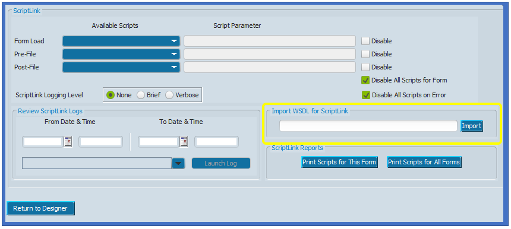

<!--
  Software manual template (b210104)
  https://github.com/APrettyCoolProgram/my-development-environment/tree/master/templates/documentation
-->

<h1 align="center">

  
  <br>
  MANUAL
  <br>

</h1>

<h4 align="center">

  MAWS v0.1&nbsp;&bull;&nbsp;Last updated January 8, 2021

</h4>

***

<!-- The HTML indentations have to stay this way to work. -->
<table>
<tr>
<td img src="non-existant-spacer.png" alt="non-existant-spacer" width="1000" height="1">

  ### CONTENTS
  * [ABOUT MAWS](#about-maws)<br>
  * [IMPORTING MAWS INTO MyAVATAR](#importing-maws-into-myavatar)<br>
  * [USING MAWS](#using-maws)<br>
    * [ADMISSION FORM](#admission-form)
    * [CROSS EPISODE FINANCIAL ELIGABLITY FORM](#cross-episode-financial-eligability-form)
  * [CUSTOM MyAVATAR™ WEB SERVICES](#custom-myavatar™-web-services)
    * [CREATING A CUSTOM MyAVATAR WEB SERVICE](#creating-a-custom-myavatar-web-service)
    * [HOSTING A CUSTOM MyAVATAR WEB SERVICE](#hosting-a-custom-myavatar-web-service)
    * [USING A CUSTOM MyAVATAR WEB SERVICE](#using-a-custom-myavatar-web-service)

</td>
</tr>
</table>

# ABOUT MAWS
The **MyAvatool Web Service** (*MAWS*) is a custom web service for Netsmart's myAvatar™ EHR which includes various tools and utilities for myAvatar™ that aren't included in the official release, and provides a solid foundation for building additional functionality quickly and efficiently.

This is the MAWS manual.

For more information about MAWS, please visit the MAWS GitHub repository:<br>
<br>
&nbsp;&nbsp;&nbsp;&nbsp;https://github.com/spectrum-health-systems/my-avatool-web-service/

### A note about the MAWS sourcecode
I've tried to make this sourcecode as human-readable as possible, but since other organizations may use MAWS I've decided to heavily comment everything as well.

I know this goes against best practice, however since Netsmart doesn't do the best job of making everything *they* do transparent, I want to make it sure that *my* code is as clear as possible as to what it does, and how it does it.

If you fork MAWS for your own development, please do not remove the original comments (and add nice, detailed comments for any functionality you add!

# IMPORTING MAWS INTO MyAVATAR

## CONFIRMING WSDL WSDL
Before attempting to import MAWS, you should make sure that you have a valid **W**eb **S**ervice **D**escription **L**anguage (WSDL) URL. To do this, paste the URL of the MAWS WSDL in a web browser and attempt to access the URL.

For example, URL of `https://your-organization.com/MyAvatoolWebService.asmx?WSDL` should display XML that looks something like this:

<h6 align="center">

  
  <br>
  An example of a WSDL file.
  <br>
</h6>

If the WSDL file *is diplayed* in the browser, that URL is what you are going to need going forward.

If the WSDL file *is not displayed*, you'll need to get a valid WSDL location before continuing.

## IMPORTING THE WSDL
Any form can be used to import a web service, and once a web service has been imported it can be used by any form that allows ScriptLink events.

We will use the *Admissions* form to import the MAWS WSDL:
1. Open the **Form Designer** form
2. Choose the "Admissions" form from the **Forms** dropdown
3. Choose the XXX tab from the **Tabs** dropdown
4. Click the **Show Tab** button
5. You will now see the form tab in designer mode. In the upper left of myAvatar™ you will see a **Settings** button:

<h6 align="center">

  
  <br>
  The "Settings" button.
  <br>
</h6>

6. Clicking the **Settings** button will bring you to the ScriptLink options page:

<h6 align="center">

  
  <br>
  The ScriptLink options page.
  <br>
</h6>
<br>

7. Copy/paste the MAWS WSDL URL into the **Import WSDL for ScriptLink** field in myAvatar™
2. Click the **Import** button.

You should get a popup letting you know the WSDL was imported successfully.


#### Where is MAWS?
MAWS has to be hosted somewhere. If you planning on self-hosting MAWS on an IIS server, I've put together some instructions that might help. 


#### Careful!


# USING MAWS
To use the MAWS with myAvatar™, you will need to add a ScriptLink event to a form event. When that event takes place, myAvatar™ will pass information to MAWS (and potentiall recieve something back).

You can add a ScriptLink event to the following form events:
* when the form loads ("Form Load")
* after the submit button is clicked, but prior to filing the form ("Pre-File")
* after the submit button is clicked and the form has been filed ("Post-File")

#### What about other form events?
You can also use custom web services with fields and controls, but that is beyond the scope of this documentation.

#### Forms that can't use ScriptLink events


## ADDING A SCRIPTLINK EVENT TO A FORM
Let's say you wanted to have MAWS do something when you hit the **Submit** button on form. To do that you would:
1. Open the **Form Designer** form
2. Choose the myAvatar™ form you want to use from the **Forms** dropdown
3. Choose the form tab from the **Tabs** dropdown
4. Click the **Show Tab** button

You will now see the form tab in designer mode. In the upper left of myAvatar™ you will see a **Settings** button:

<h6 align="center">

  
  <br>
  The "Settings" button.
  <br>
</h6>

<br>
Clicking the **Settings** button will bring you to the ScriptLink options page:
<br>

<h6 align="center">

  
  <br>
  The ScriptLink options page.
  <br>
</h6>
<br>

You need to import the MAWS WSDL into myAvatar™ before you can use it. Here's how to do that:
1. Confirm you have a valid WSDL file.


Before you actually click the **Import** button, you should make sure that the WSDL URL is correct. You can verify the WDSL URL by typing it into a web browser address bar.


For example, URL of `https://your-organization.com/AvatoolWebService.asmx?WSDL` should display XML that looks something like this:


If you see the XML:
1. Copy/paste the URL from your browsers address bar into the **Import WSDL for ScriptLink** field in myAvatar™
2. Click the **Import** button.

You should get a popup letting you know the WSDL was imported successfully.

Next we will need to choose an event that will call the Avatool Web Service, and determine the action that will take place. This will all be done on the ScriptLink options page:


Our example will call the *VerifyInpatientAdmissionDate* action on the form's *Pre-File* event:
1. Click the dropdown in the **Pre-File** row under the **Availble Scripts** column
2. Choose **AvatoolWebService** (the *red* box)
3. Type "VerifyInpatientAdmissionDate" in the **Pre-File** row under the **Script Parameter** column (the *purple* box)
4. Uncheck the **Disable All Scripts For Form** and **Disable All Scripts on Error** boxes  (the *green* box)
5. Click **Return to Designer** (the *yellow* box), and the ScriptLink options page will close, and you will be back on the **Tab Designer** page
6. Click the **Save** button, and you bw returned to the **Form Designer** page
7. Click **Submit**

### AVATOOL WEB SERVICE CALLS
Currently there is a single call in the Avatool Web Service:
* [**VerifyInpatientAdmissionDate**](https://github.com/spectrum-health-systems/AvatoolWebService/blob/development/doc/using-VerifyInpatientAdmissionDate.md): verifies that a client's Pre-Admission Date is the same as the current date.


## ADMISSION FORM

## CROSS EPISODE FINANCIAL ELIGABLITY FORM


# CREATING A CUSTOM MyAVATAR WEB SERVICE

### CONTENTS
[INTRODUCTION](#introduction)<br>
[BEFORE YOU BEGIN](#before-you-begin)<br>
[CREATING THE AVATOOL WEB SERVICE PROJECT](#creating-the-avatool-web-service-project)<br>
[ADDING A NEW WEB SERVICE TO THE PROJECT](#adding-a-new-web-service-to-the-project)<br>
[ADDING THE NETSMART SCRIPTLINK SERVICE TO THE PROJECT](#adding-the-netsmart-scriptLink-service-to-the-project)<br>
[ADDING REQUIRED METHODS](#adding-required-methods)<br>
[CLEANUP](#cleanup)<br>
[ADDITIONAL READING](#additional-reading)<br>

# INTRODUCTION
If you are curious as to how the [My Avatool Web Service](https://github.com/spectrum-health-systems/my-avatool-web-service) was created, or you are looking for some information on creating your own custom web service for myAvatar™, these are the steps I took.

## BEFORE YOU BEGIN
To create the Avatool Web Service, I used:
* [Visual Studio Community 2019](https://visualstudio.microsoft.com/vs/) (including the extensions listed [here](https://github.com/APrettyCoolProgram/my-development-environment))
* [Visual Studio Code](https://code.visualstudio.com/?wt.mc_id=DX_841432) (including the extensions listed [here](https://github.com/APrettyCoolProgram/my-development-environment))
* [GitHub Desktop](https://desktop.github.com/)
* [.NET Framework 4.6](https://dotnet.microsoft.com/download/dotnet-framework)

#### Why .NET Framework 4.6?
Personally, I would rather use .NET Core 5, but as of .NET Core 5.1, SOAP web services are not supported. I would imagine other versions of the .NET Framework would be fine, but most of my Avatool-related development has been using v4.6, so I'm sticking with that.

#### What language?
You can use any language to create a custom web service for myAvatar™. These instructions will walk through creating a web service in C#.

# CREATING THE AVATOOL WEB SERVICE PROJECT
First, we need to create an empty ASP.NET Web Application project. Using Visual Studio 2019:


1. Click **Create a new project**
2. Select **ASP.NET Web Application (.NET Framework)**
3. Click **Next**
4. Name the project (in this example, the name is "MyAvatoolWebService")
5. Choose a **Location** for your project
6. Verify that **.NET Framework 4.6** is selected
7. Click **Create**
8. In the **Create a new ASP.NET Core Web Application** dialog, select **Empty**
9. Verify that **Configure for HTTPS** (under **Advanced**) is checked
10. Click **Create**

It may take a few minutes for Visual Studio to create the project.

# ADDING A NEW WEB SERVICE
Now you have a brand new, clean ASP.NET Web Application that you can use to build your custom web service for myAvatar™!


Since we created an empty project, there aren't any valid web services available. Let's create one.

1. Right click the **Avatool-Web-Service** *project*
2. Choose **Add** > **New Item...**
3. Choose **Visual C** > **Web** > **web Service (ASMX**)
4. Name the Web Service **AvatoolWebService.asmx**
5. Click **Add**
6. Right click the **AvatoolWebService.asmx** file and choose **Set as Start Page**

# ADDING THE NETSMART SCRIPTLINK SERVICE
In order for our new AvatoolWebService Web Service to work, we'll need to add the Netsmart ScriptLink Service to our project. The Netsmart ScriptLink Service can be found in the Application Exchange on the Netsmart Cares portal.

## OBTAINING THE NETSMART SCRIPTLINK SERVICE
The Netsmart ScriptLink Service is bundled with the "Brief ScriptLink Tutorial with OptionObject2", which you will need to download from the [Netsmart Cares portal](https://netsmartcares.force.com/s/login/)

1. Login to the *[Netsmart Cares portal](https://netsmartcares.force.com/s/login/)*
2. Go to the *Application Exchange* by choosing **Community** > **App Exchange**
3. Under **Quick Links** choose **Avatar ScriptLink Library**
4. Find the "Brief ScriptLink Tutorial with OptionObject2" entry, and click **Download**

#### Make sure you have the correct file!
The downloaded file is a .zip archive with (as of January 8th, 2021) the following details:
* Name: **136_180_9_ScriptLinkTutorialWithOptionObject2.zip**
* Size: **1.85MB**
* MD5: **EC9445B70FD994A4453C4D0649208EC2**
* SHA2-256: **899617150FF9A69A6D3A7661CD4CAC304292D5F7BA775432C9B5C3FE6AA1D8F4**

## EXTRACTING THE NETSMART SCRIPTLINK SERVICE
The file you downloaded actually contains a bunch of stuff, most of which we don't need. 

1. Extract the contents of *136_180_9_ScriptLinkTutorialWithOptionObject2.zip*
2. Find this folder:
136_180_9_ScriptLinkTutorialWithOptionObject2/ScriptLinkTutorialWithOptionObject2/DotNetCode/ScriptLinkServiceComplete/**NTST.ScriptLinkService.Objects/**
3. Copy the **NTST.ScriptLinkService.Objects/** folder to the root of your project

When complete, the folder structure of the Avatool Web Service project should look like this:
```
/bin/
/NTST.ScriptLinkService.Objects/
/obj/
/packages/
/Properties/
/AvatoolWebService.asmx
/AvatoolWebService.asmx.cs
...
```

## ADDING THE NETSMART SCRIPTLINK SERVICE TO THE PROJECT
Now we need to add a reference to the Netsmart ScriptLink Service to our project.

1. Right-click the **Avatool-Web-Service** *solution* and choose **Add** > **Existing Project..**
2. Navgate to the **NTST.ScriptLinkService.Objects** folder in the */Avatool-Web-Service/*
3. Choose the  **NTST.ScriptLinkService.Objects.vbproj** file
4. Click **Open**

#### Wrong .NET Framework version?
If a message pops up letting you know that the Netsmart ScriptLink Service targets a .NET Framework version that's not installed (in this case, .NET 3.5), choose the **Change the target to .NET Framework 4.6.1...** option, then click **OK**.

## ADDING A REFERENCE TO THE NETSMART SCRIPTLINK SERVICE
Next we need to add a Netsmart ScriptLink Service reference to the Avatool Web Service project

1. Right-click the **Avatool-Web-Service** *project* and choose **Add** > **Reference..**
2. Under **Projects**, check the box that says **NTST.ScriptLinkService.Objects**
3. Click **OK**

# ADDING REQUIRED METHODS
Custom web services that interface with myAvatar™ require two methods to be present.

## THE DEFAULT ASMX.CS FILE
Your *MyAvatoolWebService.asmx.cs* file should look like this:

```
using System.Web.Services;

namespace MyAvatoolWebService
{
    /// <summary>
    /// Summary description for MyAvatoolWebService
    /// </summary>
    [WebService(Namespace = "http://tempuri.org/")]
    [WebServiceBinding(ConformsTo = WsiProfiles.BasicProfile1_1)]
    [System.ComponentModel.ToolboxItem(false)]
    // To allow this Web Service to be called from script, using ASP.NET AJAX, uncomment the following line. 
    // [System.Web.Script.Services.ScriptService]
    public class MyAvatoolWebService : System.Web.Services.WebService
    {

        [WebMethod]
        public string HelloWorld()
        {
            return "Hello World";
        }
    }
}
```

We don't need the `HelloWorld()` method, so you can remove it. Now *MyAvatoolWebService.asmx.cs* file should look like this:

```
using System.Web.Services;

namespace MyAvatoolWebService
{
    /// <summary>
    /// Summary description for MyAvatoolWebService
    /// </summary>
    [WebService(Namespace = "http://tempuri.org/")]
    [WebServiceBinding(ConformsTo = WsiProfiles.BasicProfile1_1)]
    [System.ComponentModel.ToolboxItem(false)]
    // To allow this Web Service to be called from script, using ASP.NET AJAX, uncomment the following line. 
    // [System.Web.Script.Services.ScriptService]
    public class MyAvatoolWebService : System.Web.Services.WebService
    {

    }
}
```

## ADDING THE GetVersion() METHOD
The first of the required methods is called `GetVersion()`. It looks like this:
```
[WebMethod]
public string GetVersion()
{
    return "VERSION 1.0";
}
```

Copy the `GetVersion()` method code above, and paste it where the `HelloWorld()` method was in the *MyAvatoolWebService* class.

Now your *MyAvatoolWebService.asmx.cs* file should look like this:

```
using System.Web.Services;

namespace MyAvatoolWebService
{
    /// <summary>
    /// Summary description for MyAvatoolWebService
    /// </summary>
    [WebService(Namespace = "http://tempuri.org/")]
    [WebServiceBinding(ConformsTo = WsiProfiles.BasicProfile1_1)]
    [System.ComponentModel.ToolboxItem(false)]
    // To allow this Web Service to be called from script, using ASP.NET AJAX, uncomment the following line. 
    // [System.Web.Script.Services.ScriptService]
    public class MyAvatoolWebService : System.Web.Services.WebService
    {
        [WebMethod]
        public string GetVersion()
        {
            return "VERSION 1.0";
        }

    }
}
```

## ADDING THE RunScript() METHOD

The second required method is called `RunScript()`. It looks like this:
```
[WebMethod]
public OptionObject2 RunScript(OptionObject2 sentOptionObject, string action)
{
    switch (action)
    {
        case "doSomething":
            return MethodName(sentOptionObject);
        default:
            break;
    }
    return sentOptionObject;
}
```

Copy the `RunScript()` method code above, and paste it below the `GetVersion()` method in the *MyAvatoolWebService* class.

Now your *MyAvatoolWebService.asmx.cs* file should look like this:
```
using System.Web.Services;

namespace MyAvatoolWebService
{
    /// <summary>
    /// Summary description for MyAvatoolWebService
    /// </summary>
    [WebService(Namespace = "http://tempuri.org/")]
    [WebServiceBinding(ConformsTo = WsiProfiles.BasicProfile1_1)]
    [System.ComponentModel.ToolboxItem(false)]
    // To allow this Web Service to be called from script, using ASP.NET AJAX, uncomment the following line. 
    // [System.Web.Script.Services.ScriptService]
    public class MyAvatoolWebService : System.Web.Services.WebService
    {
        [WebMethod]
        public string GetVersion()
        {
            return "VERSION 1.0";
        }

        [WebMethod]
        public OptionObject2 RunScript(OptionObject2 sentOptionObject, string action)
        {
            switch(action)
            {
                case "doSomething":
                    return MethodName(sentOptionObject);
                default:
                    break;
            }
            return sentOptionObject;
        }
    }
}
```

#### Why the red lines?
Once you have completed the above steps, you will probably notice some warnings in your code in the form of red underlines. Most likely you are getting these warnings under the text for `OptionObject2` and `MethodName`.

You are getting these warnings becuase your project doesn't know what `OptionObject2` and `MethodName` are. Let's fix that.

## ADDING THE NTST.ScriptLinkService.Objects NAMESPACE
You'll need to add a `using` statement at the top of your code so the `NTST.ScriptLinkService.Objects` is accessible. Here's how:

1. Add the following line to the top of your code:
```
using NTST.ScriptLinkService.Objects;
```

Now your *MyAvatoolWebService.asmx.cs* file should look like this:
```
using NTST.ScriptLinkService.Objects;
using System.Web.Services;

namespace MyAvatoolWebService
{
    /// <summary>
    /// Summary description for MyAvatoolWebService
    /// </summary>
    [WebService(Namespace = "http://tempuri.org/")]
    [WebServiceBinding(ConformsTo = WsiProfiles.BasicProfile1_1)]
    [System.ComponentModel.ToolboxItem(false)]
    // To allow this Web Service to be called from script, using ASP.NET AJAX, uncomment the following line. 
    // [System.Web.Script.Services.ScriptService]
    public class MyAvatoolWebService : System.Web.Services.WebService
    {
        [WebMethod]
        public string GetVersion()
        {
            return "VERSION 1.0";
        }

        [WebMethod]
        public OptionObject2 RunScript(OptionObject2 sentOptionObject, string action)
        {
            switch(action)
            {
                case "doSomething":
                    return MethodName(sentOptionObject);
                default:
                    break;
            }
            return sentOptionObject;
        }
    }
}
```

## ADDING THE MethodName METHOD
When myAvatar™ reaches out to your custom web service, it's going to ask it to perform some *action*.

You'll notice in the `RunScript()` method there is an `action` parameter that is passed. That is the *action* myAvatar™ is requesting. For this tutorial, let's pretend that the action myAvatar™ is requesting is to "doSomething".

You'll see that the switch statement has a case for "doSomething", and that case calls the `MethodName()` method. So when myAvatar™ requests that our web services "doSomething", the code in "MethodName()" will run.

A more real-world example would be myAvatar™ requesting a "checkDate" action be performed, and our web service would then execute the code in "CheckTheDatePlease()"

The `RunScript()` method  in that example would look like this:
```
[WebMethod]
public OptionObject2 RunScript(OptionObject2 sentOptionObject, string action)
{
    switch(action)
    {
        case "checkDate":
            return CheckTheDatePlease(sentOptionObject);
        default:
            break;
    }
    return sentOptionObject;
}
```

And then we would have a method called `CheckTheDatePlease()` that would do what myAvatar™ has requested.

For this tutorial, we are just going to create a method called `MethodName()`, which looks like this:
```
public static OptionObject2 MethodName(OptionObject2 sentOptionObject)
{
    return new OptionObject2();
}
```

Copy the `MethodName()` method code above, and paste it below the `RunScript()` method in the *MyAvatoolWebService* class.

Now your *MyAvatoolWebService.asmx.cs* file is complete, and should look like this:
```
using NTST.ScriptLinkService.Objects;
using System.Web.Services;

namespace MyAvatoolWebService
{
    /// <summary>
    /// Summary description for MyAvatoolWebService
    /// </summary>
    [WebService(Namespace = "http://tempuri.org/")]
    [WebServiceBinding(ConformsTo = WsiProfiles.BasicProfile1_1)]
    [System.ComponentModel.ToolboxItem(false)]
    // To allow this Web Service to be called from script, using ASP.NET AJAX, uncomment the following line. 
    // [System.Web.Script.Services.ScriptService]
    public class MyAvatoolWebService : System.Web.Services.WebService
    {
        [WebMethod]
        public string GetVersion()
        {
            return "VERSION 1.0";
        }

        [WebMethod]
        public OptionObject2 RunScript(OptionObject2 sentOptionObject, string action)
        {
            switch(action)
            {
                case "doSomething":
                    return MethodName(sentOptionObject);
                default:
                    break;
            }
            return sentOptionObject;
        }

        public static OptionObject2 MethodName(OptionObject2 sentOptionObject)
        {
            return new OptionObject2();
        }
    }
}
```

## NOW WHAT
Modify!